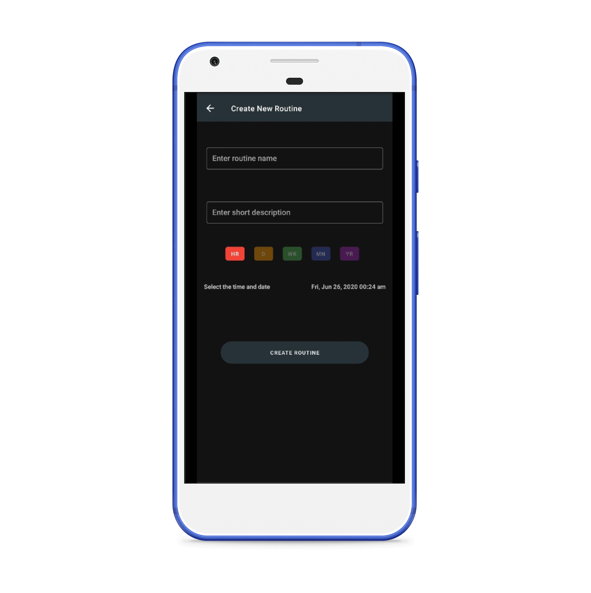
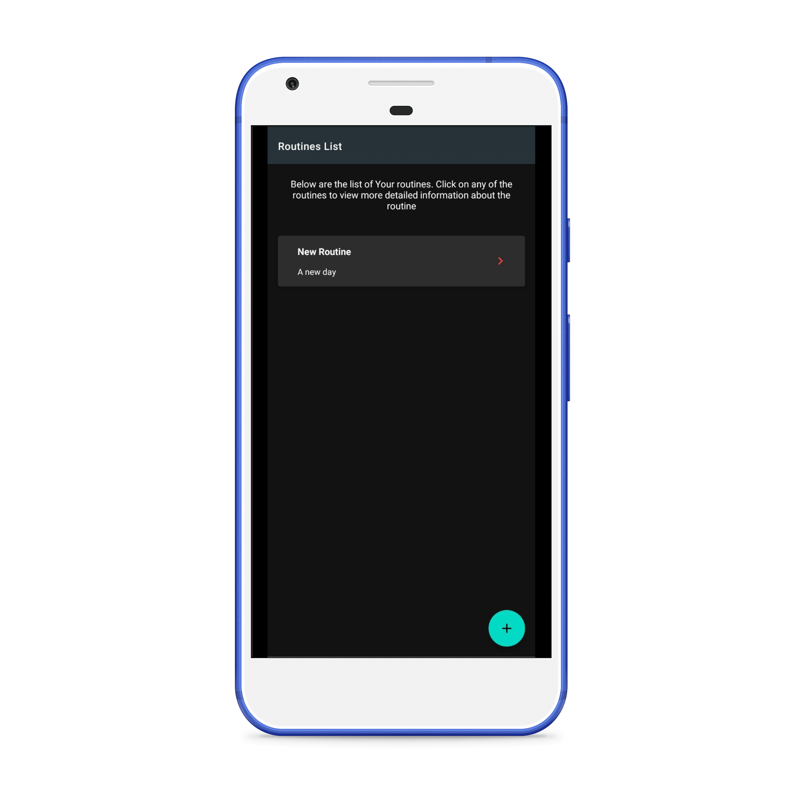
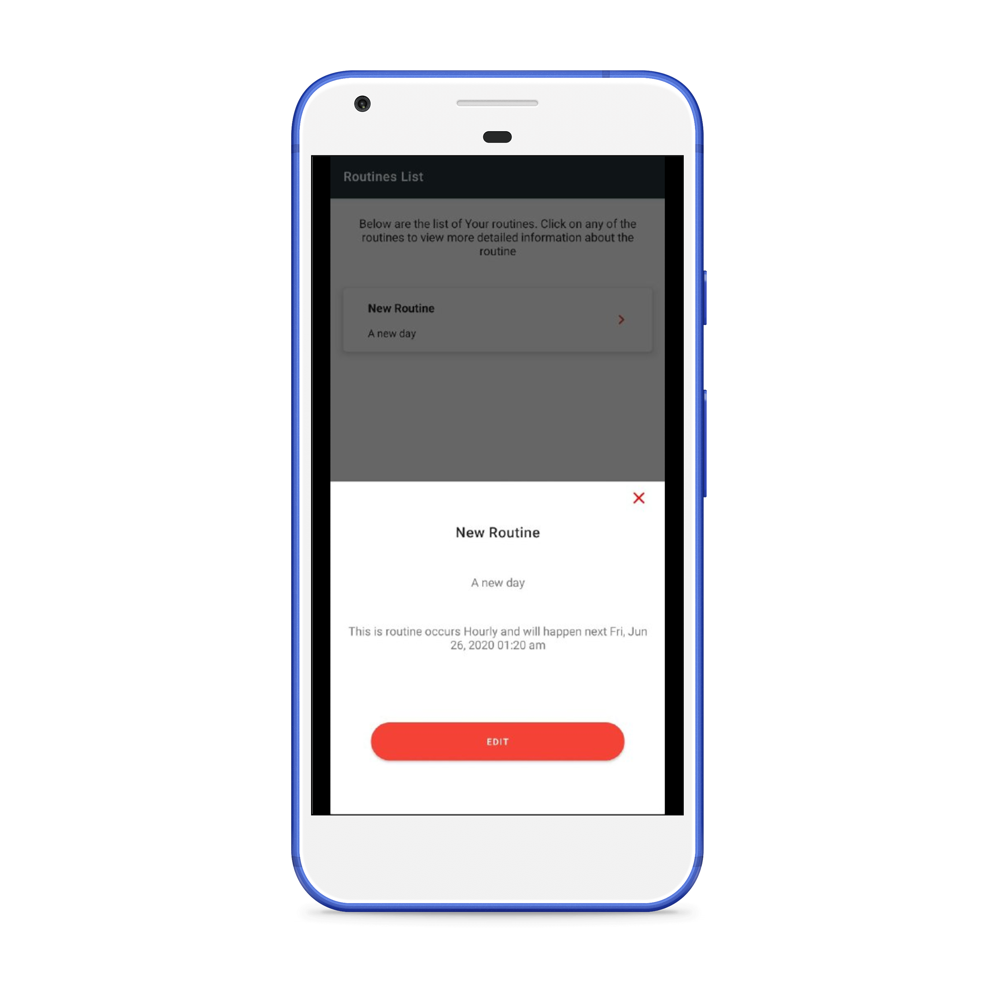

#  RoutineChecks
  

Routine Checks is an Android application that reminds you of stuff you have to do promptly but without guilt. No performance tracking, Secure and private data. No signup required. It supports Android's Dark Mode too.

In recent years, Android development has changed. There are a whole lot of new ways to do things. Although underlying truths are constant, modern implementations of several things have changed. This project utilizes cleaner and modern methods of doing Android stuff. Project is built in the MVVM pattern and written mostly in Kotlin. It includes. Dependency Injection with Dagger2, View Model and Data binding and Room as the DB layer. It Uses Fastlane for shipping and screengrabbing.

  
  

  

  
  
  

  
  

